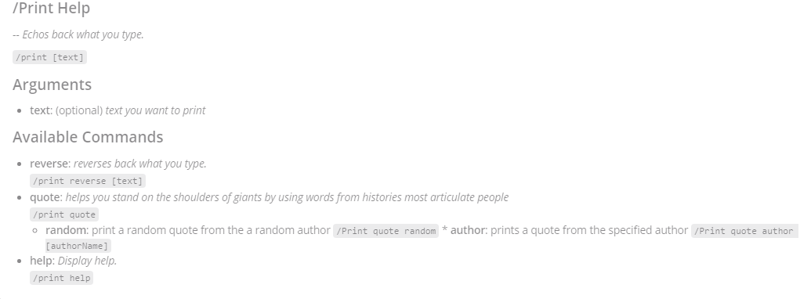

[](https://github.com/ericjaystevens/slashparse/actions)
[](https://coveralls.io/github/ericjaystevens/slashparse?branch=master)
[](https://goreportcard.com/report/github.com/ericjaystevens/slashparse)

# slashparse
Go module for parsing slash commands

This is in the proof of concept stages of development, expect frequent breaking changes and bugs.

## Design Goals

1. Support many Go implementation of Slash commands,  
1. Provide useful tooling to generate help docs and autocompletion in popular formats
1. Be opinionated about standardization and conventions in Slash commands.
1. Use text like YAML or JSON to define a command in an effort to make definitions multi-platform and easy to translate to other written languages. 


### How to use

#### Define your slash command in Yaml

You can use the provided Schema (schema.json), to validate and get autocomplete in your text editor.

```yaml
---
name: Print
description: Echos back what you type.
arguments:
  - name: text
    argtype: quoted text
    description: text you want to print
    errorMsg: foo is not a valid value for text. Expected format is quoted text.
    position: 1
subcommands:
  - name: reverse
    description: reverses back what you type.
    arguments:
      - name: text
        argtype: quoted text
        description: text you want to print
        errorMsg: foo is not a valid value for text. Expected format is quoted text.
  - name: quote
    description: helps you stand on the shoulders of giants by using words from histories most articulate people
    subcommands:
      - name: random
        description: print a random quote from the a random author
      - name: author
        description: prints a quote from the specified author
        arguments:
          - name: authorName
            argtype: text
            description: Full Name of an author
            errorMsg: Please provide a valid author name, try someone famous "
```

#### setup slashParse on load of your application

```go
package main

import com.gitlab.ericjaystevens.slashparse

const pathToYaml = "path/to/yaml"

func (p *plugin) OnActivate() Error {

  //define the slash command
  slashDef, _ := ioutil.ReadFile(pathToYaml)
  slashCommand, _ = slashparse.NewSlashCommand(slashDef)
	
  //Identify the method or functions to be called based on the command string
  //The command string is the slash command without the slash or arguments.
	p.slashCommand.SetHandler("Print", executePrint)
	p.slashCommand.SetHandler("print reverse", executePrintReverse)
	p.slashCommand.SetHandler("print quote author", executePrintQuoteAuthor)
	p.slashCommand.SetHandler("print quote random", executePrintQuoteRandom)

	return nil
}
```

#### Use slashparse to parse the incoming slash command 

```go
func (p *Plugin) ExecuteCommand(command string) (string, error) {
	msg, err := p.slashCommand.Execute(command)

	if err != nil {
		return "", error
	}
	return msg, nil
}
```

#### For your slash command and each subcommand do the work in handlers, that will have access to parsed arguments

use ```values[argumentName]``` to reference an argument's value, and you don't need to validate it exists if its required.

```go
func executePrint(values map[string]string) (msg string, err error) {

	msg = "you want my to say what? ...  " + values["text"]
	return
}
```

```go
func executePrintQuoteRandom(values map[string]string) (msg string, err error) {

	msg = "print a random quote"
	return
}
```

```go
func executePrintQuoteAuthor(values map[string]string) (msg string, err error) {

	msg = "Print a random quote from " + values["authorName"]
	return
}
```


### What your users will see

#### argument parsing

```
> /print "Hello World!"
```

will provide the expected output

```
Hello World!
```

#### Help

If your user can access generated help by running your slash command and help. 

```
/print help
```

Slash parse give nice help output. 




#### Invalid commands

This examples requires quotes for the string so if a user runs

```
/print foo
```

They will receive the error message you defined.

```
Invalid Command. Please run /print help for more information
```
